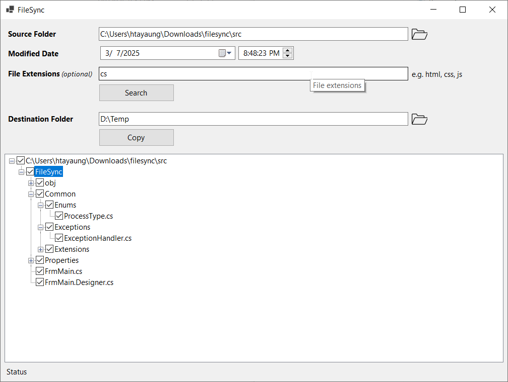
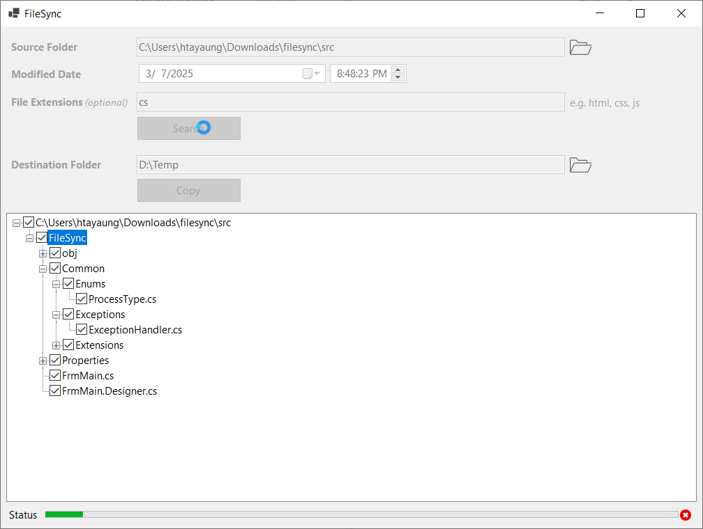

# FileSync

A Windows Forms application for searching and copying files/folders based on modification date with visual tree structure selection.

## Features

-   Search files/folders by modification date
-   Visual tree view display with checkboxes
-   Copy selected items with original structure
-   Progress bar for operations

## Technologies Used

-   C#
-   .NET 8
-   Windows Forms
-   Visual Studio

## Usage

1. **Search Files**

    - Enter source folder path
    - Select modification date cutoff
    - Click "Search" to display file tree

2. **Select Items**

    - Check/uncheck files/folders in tree view
    - Parent folders automatically check child items

3. **Copy Files**
    - Enter destination folder path
    - Click "Copy" to transfer selected items
    - Monitor progress via progress bar

## Getting Started

To get started with any of the applications, follow these steps:

1. Clone the repository:

    ```bash
    git clone https://github.com/htayaung/filesync.git
    cd src
    ```

2. Open the project in Visual Studio or Visua Studio Code.
3. Build and run the application.
4. Make sure you have .NET SDK and Visual Studio installed on your machine.

## Screenshots

<br/>
<p align="center">
  
  
</p>
